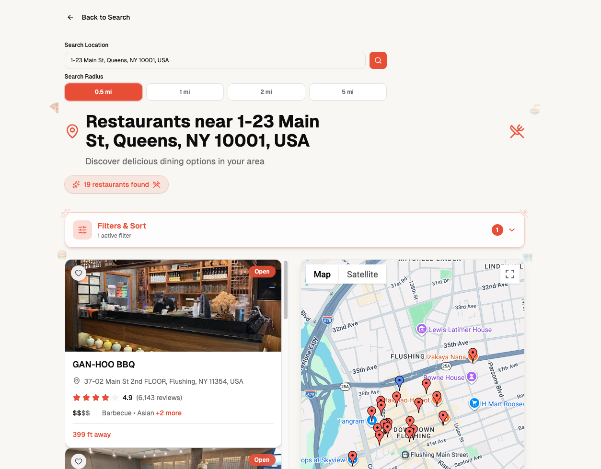
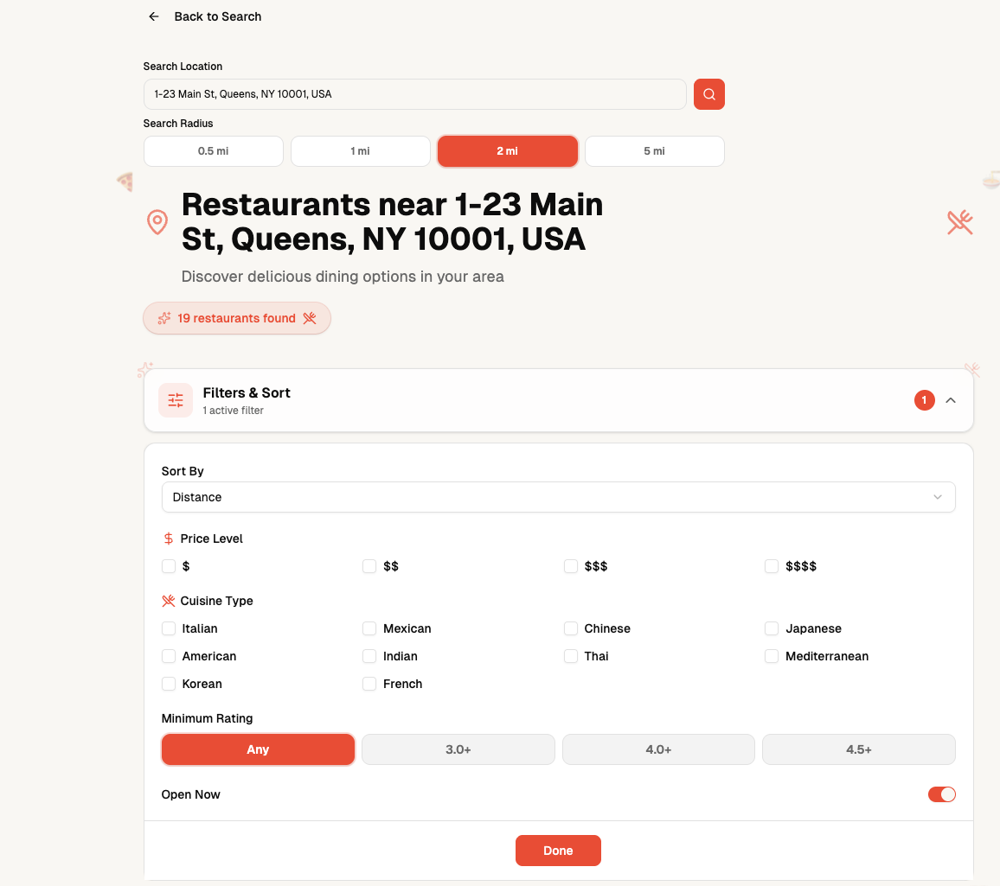
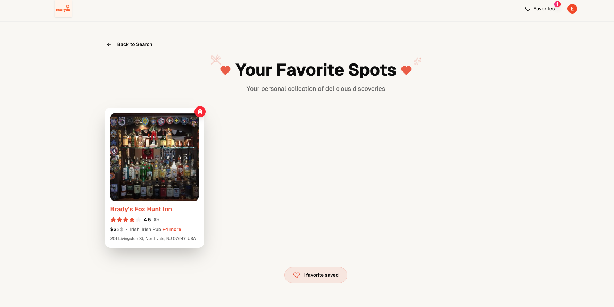

# NearYou - Restaurant Discovery Web Application

NearYou is a full-stack restaurant discovery application that allows users to search for restaurants around any destination rather than being limited to their current location.

## Why I Built NearYou

I built NearYou after noticing a frustrating UX gap while using Google Maps.

When planning trips to unfamiliar areas, I often wanted to find restaurants near a destination I was not physically at yet. I found it unnecessarily difficult to compare restaurants based on their proximity to that future destination because the distance context was often centered around my current location.

For example, if I was in New Jersey but planning to meet someone near Times Square, I wanted to enter the precise Times Square address and browse restaurants based on their proximity to that location rather than my current location.

NearYou was designed to solve that problem.

Users can enter any address or destination and explore nearby restaurants as if they were already there. Results are displayed alongside an interactive map and can be filtered, sorted, and saved to a personal favorites list.

**Status:** Previously deployed on Vercel. The application is currently available through its source code and can be run locally.

---

## Screenshots

### Restaurant Search Results

Users can enter an address or destination and browse nearby restaurants on an interactive map alongside a list of search results.



### Filters

Users can filter and reorder restaurant results to make it easier to find relevant options around their selected destination.



### Favorites

Authenticated users can save restaurants to their account and access their favorites across sessions.



---

## Key Features

- Search for restaurants near any entered address or destination
- Search using restaurant names or locations
- Interactive Google Maps interface with clickable restaurant markers
- Display restaurant results relative to the user's selected destination
- Filter and sort restaurant results, including by proximity
- Secure user authentication with Clerk
- Save and remove favorite restaurants
- Persist user favorites using PostgreSQL
- Optimistic UI updates for responsive favorite interactions
- Responsive interface with loading states and keyboard navigation

---

## Tech Stack

| Category | Technology |
|---|---|
| Framework | Next.js 15 |
| Language | TypeScript |
| Frontend | React, Tailwind CSS |
| Database | PostgreSQL (Neon) |
| ORM | Prisma |
| Authentication | Clerk |
| Maps & Places | Google Maps JavaScript API, Google Places API |
| Deployment | Previously deployed on Vercel |
| Version Control | Git, GitHub |

---

## Technical Implementation

### Full-Stack Architecture

NearYou was built as a full-stack application using Next.js.

The application combines the user interface, server-side application logic, database operations, authentication, and external API integrations within a single architecture.

### Google Maps & Places Integration

NearYou integrates with the Google Maps and Places APIs to retrieve restaurant and location data based on the destination entered by the user.

Rather than centering the restaurant discovery experience around the user's current location, the application uses the searched destination as the reference point.

This allows users to explore restaurants around locations they plan to visit before physically arriving there.

### Database Design

PostgreSQL is used to persist user favorites, with Prisma providing type-safe database access.

Favorite records store the restaurant information required to render saved restaurants rather than depending entirely on external Google Places records. Because this restaurant information originates from an external service, storing the necessary data locally helps ensure that saved favorites remain usable even if the external record changes.

A composite unique constraint using the authenticated user ID and restaurant ID prevents the same restaurant from accidentally being saved multiple times.

### Authentication

Clerk provides secure user authentication and associates saved restaurants with individual user accounts.

Authenticated users can maintain a persistent favorites list across sessions.

### Optimistic UI Updates

The favorites system uses optimistic UI updates so that saving or removing a restaurant appears immediately in the interface while the corresponding database operation is processed.

I implemented this behavior manually to better understand the update-and-reconciliation process and maintain control over how the application responds when a server-side operation fails.

### Server-Side Operations

Database mutations are handled through Next.js server actions rather than separate API routes.

This keeps database operations integrated with the App Router architecture while allowing client-side components to remain focused on presentation and interaction.

### External API Integration

The application integrates with external mapping and restaurant-data services through the Google Maps Platform.

Working with these APIs required handling location data, asynchronous requests, application state, API configuration, and failures that can occur when communicating with external services.

---

## What I Learned

NearYou was my first experience building a complete full-stack web application from the ground up.

The project gave me hands-on experience with the full software development lifecycle, including:

- identifying a real user-experience problem
- translating that problem into application requirements
- making architectural decisions
- building reusable React components
- working with TypeScript
- integrating external APIs
- designing a relational database schema
- working with PostgreSQL and Prisma
- implementing user authentication
- managing client-side and server-side state
- implementing optimistic UI behavior
- debugging interactions across the frontend, backend, database, and external services
- managing environment variables and API credentials
- deploying a production application
- maintaining and improving an existing codebase

More importantly, the project helped me understand how the individual technologies I had been learning fit together into a complete software system.

Rather than following a tutorial from beginning to end, I started with a problem I personally encountered, designed a solution around it, and worked through the technical decisions and debugging required to turn that idea into a functioning application.

---

## Running NearYou Locally

### Prerequisites

You will need:

- Node.js
- A PostgreSQL database
- A Clerk account
- A Google Maps Platform API key with the required Maps and Places APIs enabled

### Installation

Clone the repository:

```bash
git clone https://github.com/erick-chung/nearyou.git
cd nearyou
```

Install dependencies:

```bash
npm install
```

Generate the Prisma client:

```bash
npx prisma generate
```

Start the development server:

```bash
npm run dev
```

Then open:

```text
http://localhost:3000
```

### Environment Variables

The application requires environment variables for:

- PostgreSQL database access
- Clerk authentication
- Google Maps API access

Environment files containing API keys, database credentials, or other secrets are intentionally excluded from the repository.

---

## Future Improvements

Potential features I would like to explore include:

- restaurant reviews and ratings
- shareable restaurant lists
- additional cuisine and price filters
- improved restaurant ranking and recommendation logic
- additional travel-time and transportation options

---

## Author

**Erick Chung**

[LinkedIn](https://linkedin.com/in/erick-chung)  
[GitHub](https://github.com/erick-chung)
